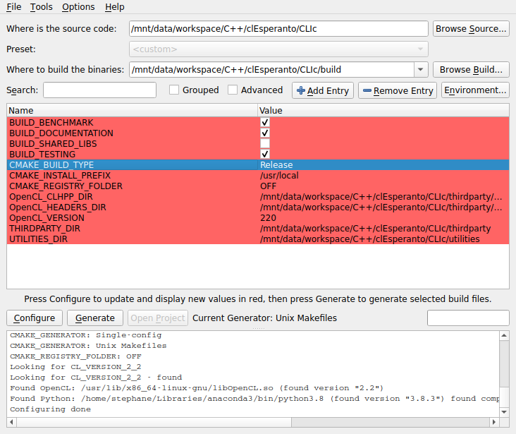

# Build from source - MacOS

<center><b>WARNING:</b> new Mac M1 and M2 chips have not been fully tested. However, they should work normally</center>

## Requirements

1. A C/C++ compiler, [XCode](https://developer.apple.com/xcode/).
2. [CMake](https://cmake.org/download/), e.g. version 3.20 or higher.
3. [OpenCL](../opencl_installation.md).

## Setting up the environment

First, install the C/C++ compiler. On MacOS, this can be done with the following commands:

```bash
xcode-select --install
```
and install CMake by either compiling it from source from their [website](https://cmake.org/download/) or with the following terminal command:
```bash
brew install cmake
```
If brew is not installed on your machine, you can check the [official website](https://brew.sh/) for installation instructions.

And finally make sure you have a working OpenCL installation. See [here](../opencl_installation.md) for more information.
## Source compilation

Once all the requirements are installed, you can compile the library from source. First, clone the repository and update the submodules:

```bash
git clone https://github.com/clEsperanto/CLIc_prototype.git
cd CLIc_prototype && git submodule update --init
```
In the clone repository, you can now use CMake to configure and build the sources
```
cmake -S . -B ./build
cmake --build ./build --parallel 4 --target Release
```
The library is now compiled.
### __CMake GUI (Alternative)__

Alternatively you can use CMake GUI for a more user-friendly project configuration.

Start CMake and configure the **source directory (1)**. Create a "build" directory as sub-folder and select it as **build directory (2)**:


In the CMAKE_BUILD_TYPE line, wither "Release" to configure a release build type.

Then run the configuration by clicking on **Configure (3)**, and choose "Unix Makefile":


Click on **Generate (4)** and afterwards open the build directory and run the command `make` in a terminal to compile the whole project as followed:
```bash
make -j4
```
You can also choose XCode when running the configuration though it is much more heavier approach.
